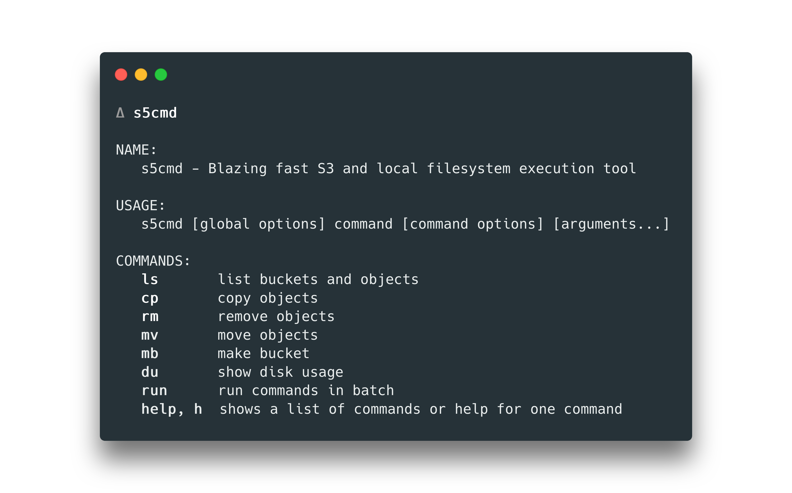

[](https://goreportcard.com/report/github.com/peak/s5cmd)

# s5cmd

`s5cmd` is a very fast S3 and local filesystem execution tool.



## Installation

### Binaries

The [Releases](https://github.com/peak/s5cmd/releases) page provides pre-build
binaries for Linux and macOS.

### Homebrew

For macOS, a [homebrew](https://brew.sh) tap is provided:

    brew tap peak/s5cmd https://github.com/peak/s5cmd
    brew install s5cmd

### Build from source

You can build `s5cmd` from source if you have [Go](https://golang.org/dl/) 1.13+
installed.

    go get github.com/peak/s5cmd

FIXME(ig): mention about master instability

## Features

FIXME(ig):

## Usage

FIXME(ig):

### Commands File

The most powerful feature of `s5cmd` is the commands file. Thousands of S3 and
filesystem commands are declared in a file (or simply piped in from another
process) and they are executed using multiple parallel workers. Since only one
program is launched, thousands of unnecessary fork-exec calls are avoided. This
way S3 execution times can reach a few thousand operations per second.

See also: [Nested Commands](#nested-commands-basic)

### Single command invocation

Single commands are also supported with the `s5cmd [command [params]]` syntax.

### Supported commands

There are three main commands: `cp`, `mv` and `rm`. Arguments can be either S3
urls, S3 wildcards, local file/directory references or local glob patterns.

- Copy, Download or Upload: `cp [options] [src] [dst]`
    - Note, the directory hierarchy will be flattened by default. Pass
      `--parents` to preserve the dir structure
- Move, Download or Upload and then delete: `mv [options] [src] [dst]`
    - Note, the directory hierarchy will be flattened by default. Pass
      `--parents` to preserve the dir structure
- Delete: `rm [src]`
- Count objects and determine total size: `du [src]`

### Examples

TODO(ig): each command will print examples, no need to document them all. Just
show a powerful command.

## Wildcard support

Multiple-level wildcards are supported in S3 operations. This is achieved by
listing all S3 objects with the prefix up to the first wildcard, then filtering
the results in-memory. ie. For batch-downloads, first a `ls` call is made, the
results are then converted to separate commands and executed in parallel.

Batch API is used deleting multiple S3 objects, so up to 1000 S3 objects can be
deleted with a single call.

**Examples:**

    ls s3://bucket/prefix/*/file*gz # Wild-list objects in bucket
    cp s3://from-bucket/prefix/*/file*gz /path/to/dest/ # Wild-download from S3
    mv s3://from-bucket/prefix/*/file*gz /path/to/dest/ # Wild-download from S3, followed by delete
    rm s3://from-bucket/prefix/*/file*gz # Wild-delete S3 objects (Batch-API)

### Tips ###

- Comments start with a space followed by `#`, as in " # This is a comment"
- Empty lines are also ok
- `-numworkers -1` means use `runtime.NumCPU` goroutines. `-2` means
  `2*runtime.NumCPU` and so on.

### S3 Credentials

S3 credentials can be provided in a variety of ways.

#### Full environment variables

Provide full S3 credentials with the environment variables:
```
AWS_ACCESS_KEY_ID=YOURKEY AWS_SECRET_ACCESS_KEY=ohnosecret AWS_REGION=us-east-1 ./s5cmd ls
```

#### Credentials file

Use the `$HOME/.aws/credentials` file:
```
[default]
aws_access_key_id = YOURKEY
aws_secret_access_key = ohnosecret
region = us-east-1
```
Then run s5cmd:
```
./s5cmd ls
```

### Shell Auto-Completion

Bash and zsh shell completion is supported, utilizing
[posener/complete](https://github.com/posener/complete). Tool and subcommand
parameters, local files/dirs, as well as remote (S3) buckets and objects are
supported.

To enable auto-completion, run:
```
s5cmd -cmp-install
```
This will add a few lines (depending on configuration) to your `.bashrc` or
`.zshrc` file. After installation, run `source .bashrc` (or restart your shell)
to activate the changes.

> Note: Auto-completion always works with AWS Endpoint, `-endpoint-url` does not override it's behaviour.


To use a different profile, set the `AWS_PROFILE` env var. For more options, see
the [AWS SDK Configuration](http://docs.aws.amazon.com/sdk-for-go/v1/developer-guide/configuring-sdk.html)
page.

## Output

s5cmd supports both text and json output.
* text format

    * success

    ```
    [operation] [source]

    # example: download s3://bucket/key
    ```
    * failure

    ```
    [ERROR|WARNING] [job] [message]

    # example: WARNING "cp s3://somebucket/file.txt file.txt" (object already exists)
    ```

* json format
    * success

    ```json
    {
      "operation": "[operation]",
      "success": true,
      "source": "[source]",
      "destination": "[destination]",
      "object": "[object]"
    }
    ```
    * failure

    ```json
    {
      "operation": "[operation]",
      "job": "[job]",
      "error": "[error]"
    }
    ```

## Supported platforms

- s5cmd is tested on Linux and macOS. Should work on Windows, however not tested
  as of release time.
- Go 1.13 and up is supported.
- Use in production environments is OK. (it works fine for us -- but as always
  with trying out new tools, proceed with caution)

# LICENSE

MIT. See [LICENSE](https://github.com/peak/s5cmd/blob/master/LICENSE).
